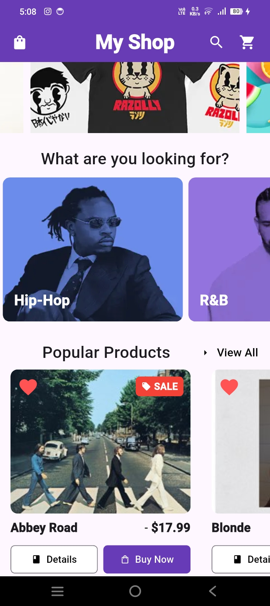

# 🛍️ My Shop - Mini E-Commerce App

A modern, responsive e-commerce mobile application built with **Flutter** and **Dart**. The app features a banner carousel slider, interactive category cards, popular product listings with status badges (Sale & Favorite), and category detail screens with responsive product grids.

---

## 📸 App Screenshots

| Home Screen | Category View |
| :---: | :---: |
|  |  |

---

## ✨ Features

- **Promotional Carousel Banner**: Interactive image slider highlighting sales, promotions, and new arrivals.
- **Category Navigation**: Horizontal scroll view showcasing music genres (Hip-Hop, R&B, Pop, Rock, Metal, Country, K-Pop) with smooth page routing.
- **Popular Products Display**: Horizontal scroll section with status overlays:
  - 🏷️ **SALE Badge**: Red offer tag for discounted products.
  - ❤️ **Favorite Badge**: Heart icon indicator for favorited items.
- **Category Grid View**: Responsive 2-column product grid with custom card action buttons (**Details** and **Buy Now**).
- **Material 3 Design**: Deep purple themed UI with clean typography and custom card shadows/radii.

---

## 📁 Project Structure

```text
my_shop/
├── assets/
│   └── images/
│       ├── banner/        # Promotion carousel images
│       ├── categories/    # Genre category background images
│       └── products/      # Product/album cover artwork
├── lib/
│   ├── main.dart          # Entry point of the app
│   ├── screens/
│   │   ├── home.dart      # Home screen with carousel, categories & products
│   │   └── categories.dart# Category grid screen
│   └── widgets/
│       └── products_categories.dart # Reusable product card widget
├── ss/                    # Application screenshots
└── pubspec.yaml           # Dependencies and asset declarations
```

---

## 🛠️ Tech Stack & Dependencies

- **Framework**: [Flutter](https://flutter.dev/)
- **Language**: [Dart](https://dart.dev/)
- **Packages**:
  - [`carousel_slider`](https://pub.dev/packages/carousel_slider) - Banner carousel widget
  - [`cupertino_icons`](https://pub.dev/packages/cupertino_icons) - iOS style icons

---

## 🚀 Getting Started

### Prerequisites

Ensure you have installed:
- [Flutter SDK](https://docs.flutter.dev/get-started/install)
- Android Studio / VS Code with Flutter extension
- An Android Emulator or Physical Device

### Installation

1. **Clone the repository**:
   ```bash
   git clone https://github.com/your-username/my_shop.git
   cd my_shop
   ```

2. **Install dependencies**:
   ```bash
   flutter pub get
   ```

3. **Run the application**:
   ```bash
   flutter run
   ```
